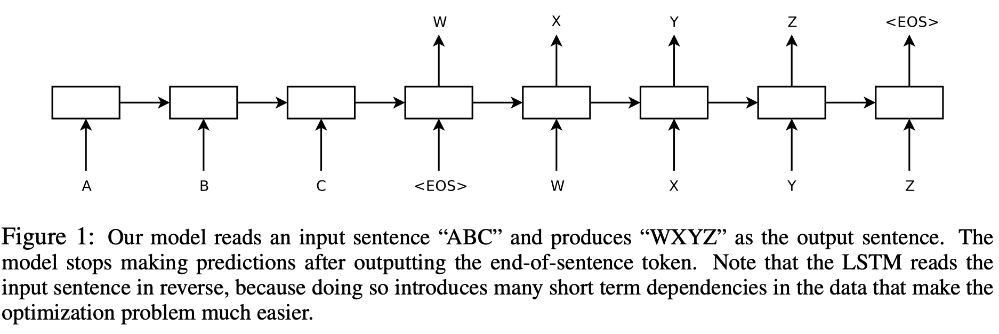

### Sequence to Sequence Learning with Neural Networks (2014) 논문 리뷰 
#### Summary
- DNN cannot be used to map sequences to sequences. (DNN은 fixed dimension에만 적용가능하기에, 길이가 다른 두 sequence에 적용시키기에 적절하지 않다)
- This paper presents **a general end-to-end approach to sequence learning** that makes minimal assumptions on the sequence structure. 
- Their method uses a multilayered Long Short-Term Memory (LSTM) to map the input sequence to a vector of a fixed dimensionality, and then another deep LSTM to decode the target sequence from the vector. 

#### Problems
 - **Problem 1. input과 output의 길이가 다를 경우**
    - A simple strategy for general sequence learning is to map the input sequence to a fixed-sized vector using one RNN, and then to map the vector to the target sequence with another RNN; RNN을 사용해서 input sequence를 고정 길이 벡터로 변환
 - **Problem 2. long term dependencies**
    - Using Long Short-Term Memory (LSTM)

#### LSTM 
- The goal of the LSTM is to estimate the conditional probability 
p(y1, . . . , yT ′ |x1, . . . , xT ) where (x1, . . . , xT) is an input sequence and 
y1, . . . , yT ′  is its corresponding output sequence whose length T ′ may differ from T. HOW?
	1. First obtaining the fixed- dimensional representation v of the input sequence (x1 , . . . , xT ) given by the last hidden state of the LSTM, 
	2. and then computing the probability of y1 , . . . , yT ′ with a standard LSTM-LM formulation whose initial hidden state is set to the representation v of x1 , . . . , xT 
	3. Each p(yt|v, y1, . . . , yt−1) distribution is represented with a **softmax** over all the words in the vocabulary. 
- Note that we require that each sentence ends with **a special end-of-sentence symbol “<EOS>”**, ~which enables the model to define a distribution over sequences of all possible lengths.~ 

#### Three Important Points
- First, **we used two different LSTMs**: one for the input sequence and another for the output sequence, because ~doing so increases the number model parameters at negligible computational cost and makes it natural to train the LSTM on multiple language pairs simultaneously~ 
- Second, **we found that deep LSTMs significantly outperformed shallow LSTMs**, ~so we chose an LSTM with four layers~. 
- Third, **we found it extremely valuable to reverse the order of the words of the input sentence.** ; input sentence의 어순을 Reverse하여 적용시킬 것 -> 매우 큰 성능 향상 So for example, instead of mapping the sentence a,b,c to the sentence α,β,γ, the LSTM is asked to map c,b,a to α,β,γ, where α, β, γ is the translation of a, b, c. This way, a is in close proximity to α, b is fairly close to β, and so on, ~a fact that makes it easy for SGD to “establish communication” between the input and the output~. We found this simple data transformation to greatly boost the performance of the LSTM. 

