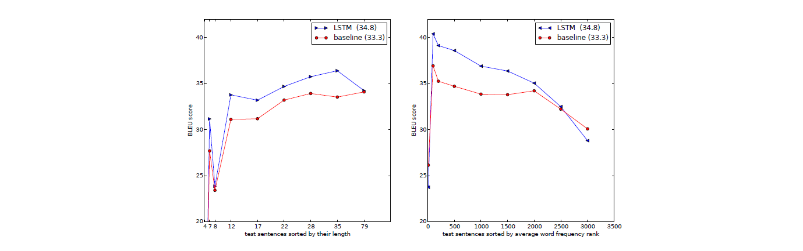

## Sequence to Sequence Learning with Neural Networks (2014) 논문 리뷰 
#### Summary
- DNN cannot be used to map sequences to sequences. (DNN은 fixed dimension에만 적용가능하기에, 길이가 다른 두 sequence에 적용시키기에 적절하지 않다)
- This paper presents **a general end-to-end approach to sequence learning** that makes minimal assumptions on the sequence structure. 
- Their method uses a multilayered Long Short-Term Memory (LSTM) to map the input sequence to a vector of a fixed dimensionality, and then another deep LSTM to decode the target sequence from the vector. 

### Model

#### Problems
 - **Problem 1. input과 output의 길이가 다를 경우**
    - A simple strategy for general sequence learning is to map the input sequence to a fixed-sized vector using one RNN, and then to map the vector to the target sequence with another RNN; RNN을 사용해서 input sequence를 고정 길이 벡터로 변환
 - **Problem 2. long term dependencies**
    - Using Long Short-Term Memory (LSTM)

#### LSTM 
- The goal of the LSTM is to estimate the conditional probability 
p(y1, . . . , yT ′ |x1, . . . , xT ) where (x1, . . . , xT) is an input sequence and 
y1, . . . , yT ′  is its corresponding output sequence whose length T ′ may differ from T. HOW?
	1. First obtaining the fixed- dimensional representation v of the input sequence (x1 , . . . , xT ) given by the last hidden state of the LSTM, 
	2. and then computing the probability of y1 , . . . , yT ′ with a standard LSTM-LM formulation whose initial hidden state is set to the representation v of x1 , . . . , xT 
	3. Each p(yt|v, y1, . . . , yt−1) distribution is represented with a **softmax** over all the words in the vocabulary. 
- Note that we require that each sentence ends with **a special end-of-sentence symbol “<EOS>”**, which enables the model to define a distribution over sequences of all possible lengths.~

#### Three Important Points
- First, **we used two different LSTMs**: one for the input sequence and another for the output sequence, because doing so increases the number model parameters at negligible computational cost and makes it natural to train the LSTM on multiple language pairs simultaneously
- Second, **we found that deep LSTMs significantly outperformed shallow LSTMs**, so we chose an LSTM with four layers. 
- Third, **we found it extremely valuable to reverse the order of the words of the input sentence.** ; input sentence의 어순을 Reverse하여 적용시킬 것 -> 매우 큰 성능 향상 So for example, instead of mapping the sentence a,b,c to the sentence α,β,γ, the LSTM is asked to map c,b,a to α,β,γ, where α, β, γ is the translation of a, b, c. This way, a is in close proximity to α, b is fairly close to β, and so on, a fact that makes it easy for SGD to “establish communication” between the input and the output. We found this simple data transformation to greatly boost the performance of the LSTM. 

### Experiments
#### Dataset
- WMT'14 English to French dataset.
- 12M sentences consisting of 348M French words and 304M English words
- Authors used 160,000 of the most frequent words for the source language and 80,000 of the most frequent words for the target language.
- Every out-of-vocabulary word was replaced with a special "UNK" token.

#### Decoding and Rescoring
- We trained it by **maximizing the log probability of a correct translation T given the source sentence S**
    -  정답 vs source 간 확률의 합이 가장 커지도록 학습
    - T^=arg max p(T|S)
- 학습이 끝나면, 가장 적합한 translation 을 찾아서 translation 을 생성함
	- with Beam Search Decoding!
    - 
	- 출처 : The neural approaches to Natural Language Generation | by Qiurui Chen |  Medium

#### Reversing the Source Sentences
- LSTM learns much better when **the source sentences are reversed** (**the target sentences are not reversed**).

#### Training details

**architecture**
- Deep LSTMs with 4 layers with 1000 celss at each layer
- 1000 dimensional word embeddings, with input vocabs 160,000 and output vocabs 80,000
- Softmax over 80,000 words at each output.

**training details**
- We initialized all of the LSTM’s parameters with the uniform distribution between -0.08 and 0.08
- We used stochastic gradient descent without momentum, with a fixed learning rate of 0.7. After 5 epochs, we begun halving the learning rate every half epoch. We trained our models for a total of 7.5 epochs.
- We used batches of 128 sequences for the gradient and divided it the size of the batch (namely, 128).
- Although **LSTMs** tend to not suffer from the vanishing gradient problem, they **can have exploding gradients** 
	- Thus we enforced a hard constraint on the norm of the gradient [10, 25] by scaling it when its norm exceeded a threshold. 
	- For each training batch, we compute s = ||g||_2, where g is the gradient divided by 128. If s > 5, we set g = 5g/s.
- Different sentences have different lengths
	- Most are short  (e.g., length 20-30) but some are long (e.g., length > 100), 
	- **so a minibatch of 128 randomly chosen training sentences will have many short sentences and few long sentences**, 
	- and as a result, much of the computation in the minibatch is wasted. 
	- **[SOL] => To address this problem, we made sure that all sentences within a minibatch were roughly of the same length**, which a 2x speedup. 

#### Experimental Results
- We used the cased BLEU score to evaluate the quality of our translations. 
	- using multi-bleu.pl1 on the tokenized predictions and ground truth. 

- an ensemble of 5 LSTMs with a beam of size 2 is cheaper than of a single LSTM with a beam of size 12.

- While the decoded translations of the LSTM ensemble do not beat the state of the art, it is the first time that a pure neural translation system outperforms a phrase-based SMT baseline on a large MT task

